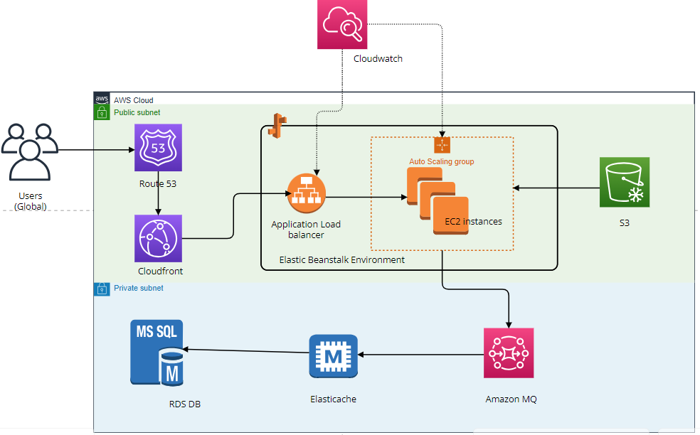

# cloud-project-3
**Public subnet**
    - Beanstalk (one each for Tomcat, nginx, ) + LB
    - Autoscaling 
    - S3, EFS

*Backend services (Private subnet)*
    - RDS
    - Elastic cache
    - Active MQ
    - Route 53
    - Cloudfront 
    - ACM

Architectural diagram
Below is the architectural diagram for this project.

See [project description](project_description3.pdf) for more details